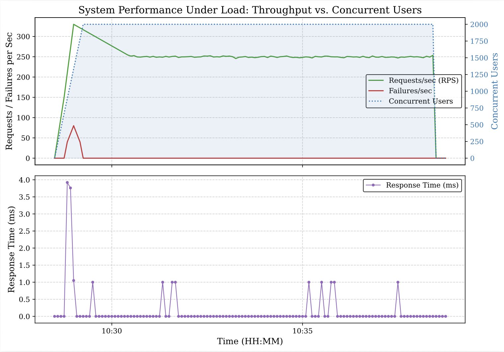

当然可以！在 GitHub 的 `README.md` 中，你可以直接使用 Markdown 表格语法将论文中的高并发压测数据（Table III）以结构化的形式完美呈现 。配合上一步你上传的性能折线图（Fig. 9），能让你的开源项目主页瞬间具备工业级工程验证的严谨性 。

这里是为你重新设计并整合了**图表嵌入 + 完整压测数据集**的 `README.md` 规范内容：

```markdown
# Ride-Hailing GPS Stream Load Test

This repository contains the WebSocket load testing module from our research on modern ride-hailing systems. It is designed to simulate 2,000 concurrent driver GPS WebSocket streams to evaluate the high-concurrency capacity of the distributed serverless architecture.

## 📊 Performance Metrics & Results

After establishing connections, the platform successfully stabilized at approximately **248.37 Requests Per Second (RPS)** with a **0% failure rate** on active streaming. The system demonstrated an exceptional median response time of merely **0.11 ms** and a 99th percentile (P99) latency of strictly **1 ms**, confirming the high-concurrency capability of the AWS serverless container architecture.

### 📈 System Performance Under Load


### 📋 Detailed Locust Load Testing Statistics (Table III)
Below is the empirical validation data recorded during the maximum stress period:

| Name | Type | # Reqs | # Fails | Med (ms) | 95% (ms) | 99% (ms) | Avg (ms) | Min (ms) | Max (ms) | Size (bytes) | RPS | Fails/s |
| :--- | :---: | ---: | ---: | ---: | ---: | ---: | ---: | ---: | ---: | ---: | ---: | ---: |
| **GPS stream** | WS | 145,238 | 0 | 0.11 | 1 | 1 | 0.38 | 0 | 11 | 96.96 | 246.4 | 0 |
| **WS** | connect | 1,754 | 1,754 | 0 | 0 | 0 | 0 | 0 | 0 | 0 | 0 | 0 |
| **Aggregated** | **-** | **146,992** | **1,754** | **0** | **1** | **1** | **0.38** | **0** | **11** | **95.81** | **246.4** | **0** |

---

## 🛠 Prerequisites (依赖安装)
Ensure you have Python 3 installed. Clean up any existing conflicting websocket libraries and install the required ones:

```bash
pip3 uninstall websocket -y
pip3 install websocket-client websockets

```

## 🚀 How to Run (完整运行步骤)

### Step 1: Start the WebSocket Server (启动服务器)

Open a terminal window and run the server script:

```bash
python3 ws_server.py

```

You must see the output `WebSocket server started on ws://localhost:8765` to proceed.
**⚠️ Note:** Keep this terminal window open and running.

### Step 2: Verify the Server (验证服务器 - Optional)

Open a new terminal window (Command+N) and run the following quick validation:

```bash
python3 -c "
import websocket
ws = websocket.create_connection('ws://localhost:8765')
ws.send('hello')
print('收到回复:', ws.recv())
ws.close()
"

```

You should see `收到回复: hello`.

### Step 3: Start Locust (启动 Locust 测试)

In the same secondary terminal window, start the Locust process:

```bash
python3 -m locust -f locustfile.py --host ws://localhost:8765

```

### Step 4: Run the Test via Web UI (通过浏览器面板开始测试)

1. Open your browser and navigate to **http://localhost:8089**.
2. Fill in the parameters:
* **Users**: 2000
* **Spawn rate**: 100


3. Click "Start swarming" to observe the real-time load test results.

```
